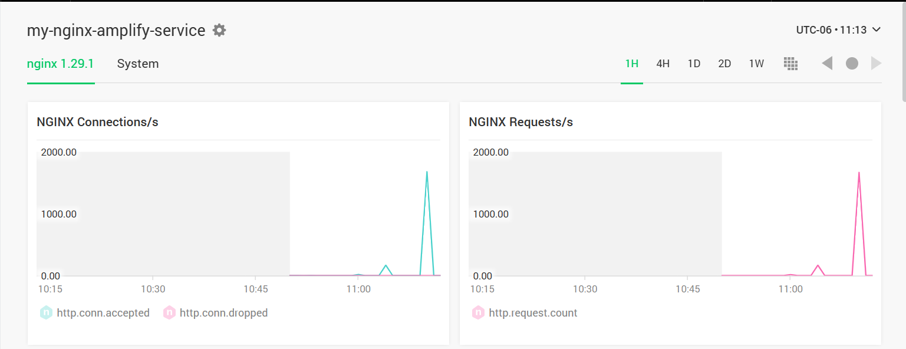

# NGINX Amplify
This repo is a demo of how NGINX servers can be monitored using Amplify, a web based GUI that allows GUI and traffic monitoring.

For simplicity, I used an Amplify-ready image based on [this repository](https://github.com/nginxinc/docker-nginx-amplify/). The instructions on how to generate the image and get it up and running are documented [here](https://github.com/nginxinc/docker-nginx-amplify/?tab=readme-ov-file#2-how-to-build-and-run-an-amplify-enabled-nginx-image).

The contents of that repository can be customized to fit your needs.

In this repository you will find a `docker-compose.yml` file that only needs the environment API_KEY to match the one in given to you by Amplify.

Once the file is ready execute the following command to run the container:

`docker compose -f docker-compose.yml up -d`

After a few minutes, check Amplify and you should see a new dashboard created for the new system.

## Exploring Amplify
Amplify has two different tabs for each one of the servers that are created. One is the nginx tab, which tells the amount of traffic going through the server. 

The other tab called System tells how the hardware is being utilized. 

We can monitor these two tabs and make correlations based on traffic and system utilization to make adjustments on how the resources are being utilized.

## Stress Test
To have more descriptive data on how a real production server works, we can simulate traffic by using `ApacheBench`. The following command will send several requests through different clients:

`ab -n 100000 -c 1000 http://localhost:8080/`

ApacheBench will provide some statistics on the server's performance:

We can see the effects of these requests on the dashboard:

## Optimizations
To optimize nginx's request handling capabilities, we can configure two different fields in the `nginx.conf` file which are `worker processes` and `worker connections`.

By default `worker processes` comes as auto. Which will automatically adjust the number of worker processes to be the same as the amount of cores in the server's CPU. This helps to prevent over-allocation. 

We can also change the `worker connections` to change the amount of simultaneous number of connections that each nginx worker process can handle. 

In this case I increased the amount of `worker connections`, which led to a poorer perfomance and response time compared to before, which was caused to my hardware limitations. It consumed more resources to handle the same amount of requests as before:

These config options require testing because they are hardware dependant, which leads to having different configurations based on the resources available and also the amount of traffic expected to that specific server.